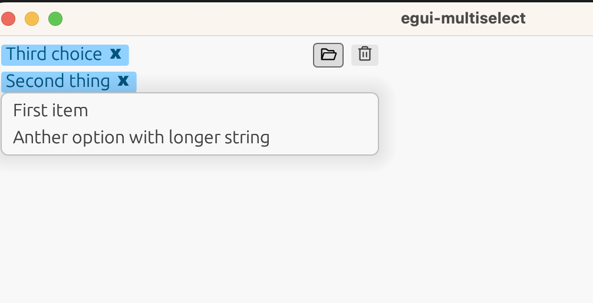
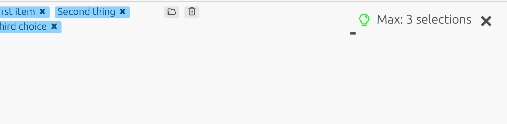

# egui-multiselect

A multiselect widget for Egui



Most inspiration borrowed from **ItsEthra dropdown**
The clunky bits are mine.

## Functionality

Select multiple items from a list. The maximum amount of choices must be defined. 
It uses **egui-notify** to notify when the amount is fulfilled.
Clicking the x on the item removes it from the selections. 



## Usage
```rust
// Working example can be found in `examples/multiselect.rs`

ui.add(MultiSelect::new(
format!("test_multiselect {}", &self.max_opt),
&mut self.items,
&mut self.ms_answers,
&self.options,
|ui, _text| ui.selectable_label(false, _text),
&self.max_opt,
&mut self.toasted,
));
```